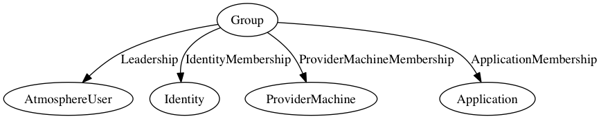

# Glossary of atmosphere

## Overview

- [AtmosphereUser](#atmosphere-user) - The model responsible for user metadata (username, email, ...)
- [Tag](#tag) - A bit of text which serves as a label
- [Instance](#instance) - The metadata for a virtual machine (name, creator, ...)
- [Volume](#volume) - The metadata for a virtual hard drive (size, name, description)
- [Group](#group) - An association of users and cloud resources (instances, volumes, ...)
- [Application](#application) - The user-facing metadata for an image (name, description, icon)
- [ApplicationVersion](#applicationversion) - A particular release of an Application
- [ProviderMachine](#providermachine) - The pairing of an image and a provider
- [InstanceSource](#instancesource) - The common denominator for bootable
  things (provider machines, volumes, snapshots)
- [Provider](#provider) - The metadata necessary to represent a cloud
- [Identity](#identity) - The relationship between a user and a specific provider
- [Membership](#membership) - A resource paired with a group
- [ProviderCredential](#providercredential) - Credentials unique for each
  provider

## Application
An Application is sometimes referred to as an Image. Applications are mostly
metadata like an icon and associated [tags](#tag). See [applications in
context](#applications-in-context) for their role in the larger application.

```
{
    'icon': 'machine_images/bsa.png',
    'name': 'New Biotools Demo (11/04/2011)',
    'description': 'Biotools Demo Image - 11/04/2011',
    'private': False,
    ...
}
```

## Group
A group allows members of the group to share resources. For example, members in a group
could each see the groups' instances or the groups' images. The groups
members are a collection of [AtmosphereUser](#atmosphereuser).

A group contains the following:
    - a list of atmosphere users
    - a list of instances
    - a list of identities
    - a list of applications
    - a list of provider machines

If you dig into the models, you'll see something more like the graph below.
Where lists of models are represented by a [Membership](#membership).



## Membership
Membership is the association between a resource and a group. For example, a 
[Group](#group) contains a list of identities. This is modeled with an Identity
Membership relation, where each row is a group and identity pair.


## AtmosphereUser

This model stores all user metadata.
```
from core.models import AtmosphereUser as User

user = User.objects.get(username='cdosborn')
```

## Identity
An identity is the pairing of an [AtmosphereUser](#atmosphereuser) and a
[Provider](#provider). An identity
doesn't store anything else.
```
from core.models import Identity

ident = Identity.objects.get(created_by__username='cdosborn', provider__id=4)
ident.created_by # <AtmosphereUser: cdosborn>
ident.provider # <Provider: 4:iPlant Cloud - Tucson>
```

## Provider Machine
A machine is a specicific version of an image for a specific provider. The
image hierarchy allows for applications to have versions and each version to
exist on a provider. A provider machine is that bottom layer. Every provider
machine has a 1-1 relationship with an [InstanceSource](#instance-source). 
```
from core.models import ProviderMachine

machine = ProviderMachine.objects.first()
machine.provider
machine.instance_source
machine.application_version
```

## Tag
A tag is just a bit of text which serves as a label. Images have tags like `ubuntu`,
`trnrs`, `biopython`. However, tags do not store any information about what
they are tagging. In order to express the relationship between a model and
its tags, an additional model must encode the relationship. For example
`application_tag` is a model with two fields a tag id and an image id.
```
{
    'name': 'prc1',
    'description': 'a repressor complex',
    ...
}
```

## ProviderMachine
**TODO**

## InstanceSource
**TODO**

## ProviderCredential
**TODO**

## Instance
**TODO**

## Volume
**TODO**

## ApplicationVersion
**TODO**


## Applications in context
Images have a specific hierarchy which allows them to have multiple versions
and allows in turn for each version to exist on particular providers.

